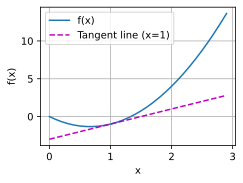

```python
# Jupyter Notebook魔法命令，用于在Notebook中内联显示图表
%matplotlib inline

# 导入NumPy库，用于高效的数值计算
import numpy as np

# 从matplotlib_inline库导入backend_inline模块，用于设置图表显示格式
from matplotlib_inline import backend_inline

# 从d2l库导入PyTorch相关工具（d2l是《动手学深度学习》配套库）
from d2l import torch as d2l


# 定义目标函数f(x) = 3x² - 4x
def f(x):
    return 3 * x ** 2 - 4 * x


# 定义数值导数计算函数，使用前向差分公式
def numerical_lim(f, x, h):
    return (f(x + h) - f(x)) / h


# 初始化步长h为0.1
h = 0.1

# 进行5次迭代计算
for i in range(5):
    # 格式化输出当前步长和数值导数结果（保留5位小数）
    print(f'h={h:.5f}, numerical limit={numerical_lim(f, 1, h):.5f}')
    # 每次迭代将步长缩小10倍
    h *= 0.1


# 定义函数：设置在Jupyter中使用SVG格式显示图表
def use_svg_display():  #@save
    """使用svg格式在Jupyter中显示绘图"""
    backend_inline.set_matplotlib_formats('svg')


# 定义函数：设置图表尺寸
def set_figsize(figsize=(3.5, 2.5)):  #@save
    """设置matplotlib的图表大小"""
    use_svg_display()  # 调用之前定义的函数设置显示格式
    d2l.plt.rcParams['figure.figsize'] = figsize  # 设置图表尺寸参数


# 定义函数：设置坐标轴属性
def set_axes(axes, xlabel, ylabel, xlim, ylim, xscale, yscale, legend):
    """设置matplotlib的轴"""
    axes.set_xlabel(xlabel)       # 设置x轴标签
    axes.set_ylabel(ylabel)       # 设置y轴标签
    axes.set_xscale(xscale)       # 设置x轴刻度类型（线性/对数等）
    axes.set_yscale(yscale)       # 设置y轴刻度类型
    axes.set_xlim(xlim)           # 设置x轴范围
    axes.set_ylim(ylim)           # 设置y轴范围
    if legend:                    # 如果有图例
        axes.legend(legend)       # 添加图例
    axes.grid()                   # 显示网格线


# 定义函数：绘制图表
def plot(X, Y=None, xlabel=None, ylabel=None, legend=None, xlim=None,
         ylim=None, xscale='linear', yscale='linear',
         fmts=('-', 'm--', 'g-.', 'r:'), figsize=(3.5, 2.5), axes=None):
    """绘制数据点"""
    if legend is None:            # 如果未传入图例
        legend = []               # 初始化为空列表

    set_figsize(figsize)          # 设置图表尺寸
    axes = axes if axes else d2l.plt.gca()  # 获取当前坐标轴对象

    # 定义内部函数：判断是否为单轴数据
    def has_one_axis(X):
        return (hasattr(X, "ndim") and X.ndim == 1 or isinstance(X, list)
                and not hasattr(X[0], "__len__"))

    if has_one_axis(X):           # 如果X是单轴数据
        X = [X]                   # 转换为列表形式

    if Y is None:                 # 如果未传入Y数据
        X, Y = [[]] * len(X), X   # 将X转换为与Y长度一致的列表

    elif has_one_axis(Y):         # 如果Y是单轴数据
        Y = [Y]                   # 转换为列表形式

    if len(X) != len(Y):          # 如果X和Y长度不一致
        X = X * len(Y)            # 重复X数据以匹配Y长度

    axes.cla()                    # 清空当前坐标轴
    for x, y, fmt in zip(X, Y, fmts):  # 遍历数据和格式
        if len(x):                # 如果x数据不为空
            axes.plot(x, y, fmt)  # 绘制x-y曲线
        else:                     # 如果x数据为空
            axes.plot(y, fmt)     # 直接绘制y数据

    # 设置坐标轴属性
    set_axes(axes, xlabel, ylabel, xlim, ylim, xscale, yscale, legend)


# 生成x数据：从0到3，步长0.1
x = np.arange(0, 3, 0.1)

# 绘制图表：
# 绘制f(x)和切线2x-3
# 设置x轴标签为'x'，y轴标签为'f(x)'
# 添加图例['f(x)', 'Tangent line (x=1)']
plot(x, [f(x), 2 * x - 3], 'x', 'f(x)', legend=['f(x)', 'Tangent line (x=1)'])
```

    h=0.10000, numerical limit=2.30000
    h=0.01000, numerical limit=2.03000
    h=0.00100, numerical limit=2.00300
    h=0.00010, numerical limit=2.00030
    h=0.00001, numerical limit=2.00003
    


    

    

